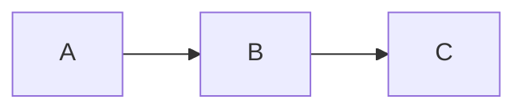

# CheatSheet App — Dokumentáció

## Áttekintés

Nuxt 4 alapú, kereshető fejlesztői referencia-lap alkalmazás. A tartalom Markdown fájlokból épül fel, amelyeket a Nuxt Content v3 modul indexel és szolgál ki.

## Tech stack

| Csomag | Verzió | Szerep |
|---|---|---|
| `nuxt` | ^4 | Framework (`srcDir: app/`) |
| `@nuxt/content` | ^3 | MD tartalom kezelése és lekérdezése |
| `@nuxt/ui` | ^4 | UI komponensek (UModal, UButton, UBadge, stb.) |
| `tailwindcss` | ^4 | Utility CSS |
| `@vueuse/nuxt` | ^14 | Vue composable-ok |
| `mermaid` | ^11 | Mermaid diagram rendering |
| `better-sqlite3` | ^12 | Content SQLite adatbázis (runtime) |

## Projekt struktúra

```
my-cheatsheet/
├── app/
│   ├── layouts/
│   │   └── default.vue              # Sidebar layout, keresés, mobile topbar
│   ├── pages/
│   │   ├── index.vue                # Főoldal (kategória kártyák)
│   │   └── [...slug].vue            # Cheatsheet lap megjelenítő
│   ├── components/
│   │   ├── content/
│   │   │   └── ProsePre.vue         # Kódblokk override (Mermaid support)
│   │   └── icons/
│   │       ├── app-icon.vue         # Icon wrapper komponens
│   │       ├── app-icon-default.vue # Fallback SVG ikon
│   │       ├── app-css3.vue
│   │       ├── app-git.vue
│   │       ├── app-html5.vue
│   │       ├── app-javascript.vue
│   │       ├── app-nuxt.vue
│   │       ├── app-react.vue
│   │       ├── app-sass.vue
│   │       ├── app-tailwind.vue
│   │       ├── app-typescript.vue
│   │       └── app-vuejs.vue
│   ├── composables/
│   │   └── useIcon.ts               # Kategórianév → SVG komponens mapping
│   └── assets/css/
│       └── main.css                 # Globális stílusok, reszponzív prose heading méretek
├── content/                         # Markdown tartalom
│   ├── 1.CSS/
│   ├── 2.JavaScript/
│   └── 3.Angular/
└── nuxt.config.ts
```

## Tartalom hozzáadása

Hozz létre egy mappát `content/` alatt (a szám-prefix a sorrendet határozza meg), majd adj hozzá `.md` fájlokat:

```markdown
---
title: Flexbox alapok
description: A legfontosabb Flexbox tulajdonságok gyűjteménye.
---

## Bevezetés
...
```

A mappa neve automatikusan megjelenik a sidebar navigációban. A `description` mező megjelenik a főoldalon és a keresési snippetben.

### Mappa elnevezési konvenció

```
content/
├── 1.CSS/          → sidebar: "CSS"
├── 2.JavaScript/   → sidebar: "JavaScript"
└── 3.Angular/      → sidebar: "Angular"
```

A vezető szám és pont (pl. `1.`) csak a sorrendet befolyásolja.

### Mermaid diagramok

A Markdown fájlokban standard mermaid kódblokkkal használható:

~~~markdown

~~~

A `ProsePre.vue` komponens felismeri a `mermaid` nyelvet és mermaid.js-sel rendereli SVG-ként. Minden más kódblokk Shiki szintaxiskiemelővel jelenik meg, változatlanul.

## Ikon rendszer

### Komponensek

- **`app-icon.vue`** — wrapper, a `useIcon` composable-lal betölti a megfelelő SVG komponenst
- **`app-icon-default.vue`** — egyedi "code document" SVG, fallback ismeretlen kategóriákhoz
- Egyedi SVG ikonok: `app-css3.vue`, `app-javascript.vue`, `app-typescript.vue`, `app-html5.vue`, `app-vuejs.vue`, `app-react.vue`, `app-git.vue`, `app-nuxt.vue`, `app-sass.vue`, `app-tailwind.vue`

### `useIcon.ts` composable

Kategórianév string → Vue komponens mapping:

```ts
import { useIcon } from '~/composables/useIcon'
const iconComponent = useIcon('css')  // → AppIconCss3 komponens
```

Ismert kulcsok: `css`, `css3`, `javascript`, `js`, `typescript`, `ts`, `html`, `html5`, `vue`, `vuejs`, `react`, `git`, `nuxt`, `sass`, `scss`, `tailwind`, `tailwindcss`

### Használat

```vue
<AppIcon name="JavaScript" :size="24" variant="original" />
```

**Fontos:** mindig `variant="original"` — a `muted` variant olyan CSS változókat használ, amelyek nem elérhetők ebben a projektben (fekete kitöltést okoz).

### `nuxt.config.ts` beállítás

```ts
components: [{ path: '~/components', pathPrefix: false }]
```

Ez teszi lehetővé, hogy `<AppIcon>` névvel lehessen használni az `icons/` alkönyvtárban lévő komponenst (alap esetben `<IconsAppIcon>` lenne).

## Főbb komponensek

### `layouts/default.vue`

Az alkalmazás kerete: sidebar + főtartalom.

**Desktop viselkedés:**
- Bal oldali fix sidebar (256px széles)
- Összecsukható gombbal → 56px collapsed mód (csak ikonok)
- Kattintásra összecsukott kategória megnyitja a sidebaret

**Mobil viselkedés (`<768px`):**
- A sidebar alapból rejtett (`position: fixed; left: -272px`)
- Felső topbar jelenik meg: hamburger gomb + logo + keresés ikon
- Hamburger → sidebar drawer kicsúszik balról, backdrop sötétíti a hátteret
- Backdroper vagy X gomb bezárja

**Navigáció:**
- Kategóriánként összecsukható szekciók (custom `button` + `Transition`, nem `UAccordion`)
- Kategória előtt `<AppIcon>` SVG ikon jelenik meg
- Aktív lap kiemelve (`nav-item--active` class, primary szín + bal border)
- Az aktuális route kategóriája automatikusan kinyílik navigáláskor

**Keresés:**
- `useState('search-open')` — megosztott állapot layout és lapok között
- `UModal` alapú search modal

### `pages/[...slug].vue`

A cheatsheet lapok megjelenítője.

**Adatlekérés:**
```ts
const { data: page } = await useAsyncData(
  () => `page-${route.path}`,   // reaktív key → újratölt navigáláskor
  () => queryCollection('content').path(route.path).first()
)
```

A reaktív key (függvény formában) biztosítja az újratöltést, ha ugyanazon layout-on belül másik lapra navigálunk.

**Topbar:** `useState('search-open')` megnyitja a keresés modalt.

**Prev/Next navigáció:** azonos kategórián belüli szomszéd lapok.

### `pages/index.vue`

Főoldal: minden kategória kártyaként jelenik meg a benne lévő lapok listájával.

## Keresés

A keresés client-side, teljes tartalom (full-text) alapú.

**Adatforrás:**
- `queryCollection('content').all()` — minden dokumentum betöltése
- `queryCollectionNavigation('content')` — navigációs fa (cím, kategória)

**Keresési logika:**
1. **Cím / kategória egyezés** (prioritás): `doc.title` és `doc._catTitle` alapján
2. **Tartalmi egyezés**: `JSON.stringify(doc.body)` — az egész body AST JSON-ja tartalmaz minden szöveget (táblázatcellák, kódblokkok, bekezdések)

```ts
// Megbízható tartalom-keresés: az AST struktúrától független
const bodyJson = JSON.stringify(doc.body ?? '').toLowerCase()
bodyJson.includes(searchQuery)
```

A tartalmi találatoknál a `description` frontmatter mező jelenik meg snippetként (ha van).

**A keresés megnyitható:**
1. A sidebar "Keresés..." gombjával (desktop)
2. A mobil topbar keresés ikonjával
3. A cheatsheet lap topbarjának nagyítójával

## Reszponzív tipográfia

Mobilon (`<768px`) a prose heading méretek kisebbek:

```css
@media (max-width: 767px) {
  .prose h1 { font-size: 1.5rem; }
  .prose h2 { font-size: 1.25rem; }
  .prose h3 { font-size: 1.1rem; }
  .prose h4 { font-size: 1rem; }
}
```

## Nuxt Content v3 — fontos tudnivalók

- Navigációs item path: `item.path` (nem `item._path` mint v2-ben)
- Dokumentum lekérés: `queryCollection('content').path(route.path).first()`
- Navigáció lekérés: `queryCollectionNavigation('content')`
- A `useAsyncData` key legyen függvény, ne string, ha reaktív újratöltés kell

## Szín konfiguráció

Az `app/app.config.ts`-ben:
```ts
ui: {
  colors: { primary: 'green', neutral: 'slate' }
}
```

A zöld skálát a `main.css` definiálja (`--color-green-*` változók).

## Fejlesztői parancsok

```bash
npm run dev       # fejlesztői szerver (http://localhost:3000)
npm run build     # produkciós build
npm run preview   # build előnézet
npm run typecheck # TypeScript ellenőrzés
npm run lint      # ESLint
```
