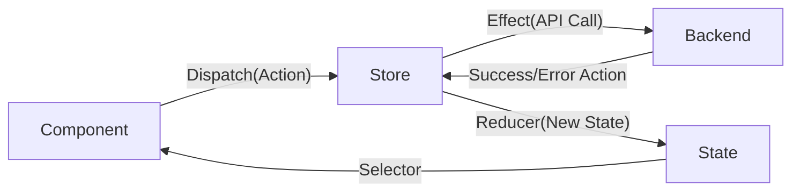

# Action létrehozása

```ts
import { Action, createAction, props } from '@ngrx/store';

export const INCREMENT = '[Counter] increment';
export const DECREMENT = '[Counter] decrement';
export const RESET = '[Counter] Reset';

export const increment = createAction(INCREMENT, props<{ value: number }>());

/*export const increment2 = createAction(
  INCREMENT,
  props<{ email: string; passord: string }>
);*/
export const decrement = createAction(DECREMENT);
export const reset = createAction(RESET);

//másik mód action-ok létrehozására

/*
export class IncrementAction implements Action {
  public readonly type = INCREMENT;

  //payload any type of data
  constructor(public payload: number) {}
}

export type CounterActions = IncrementAction;
*/
```

# Reducer létrehozása

```ts
import { Action, createReducer, on } from '@ngrx/store';
import { decrement, INCREMENT, increment, reset } from './counter.action';

const initialState = 0;

export const counterReducer = createReducer(
  initialState,
  on(increment, (state, action) => (state = state + action.value)),
  on(decrement, (state) => (state = state - 1)),
  on(reset, (state) => (state = 0))
);

/*
ez a régi alternatív szintaxis
alternatív szintaxis


export function counterReducer(
  state = initialState,
  action: IncrementAction | Action
) {
  if (action.type === INCREMENT) {
    console.log((action as IncrementAction).payload);
    let payload = (action as IncrementAction).payload;
    return state + payload;
  }

  return state;
}
*/
```

# Effect létrehozása

```ts
import { Actions, createEffect, ofType } from '@ngrx/effects';
import { increment } from './counter.action';
import { tap } from 'rxjs';
import { inject, Injectable } from '@angular/core';
@Injectable()
export class CounterEffects {
  constructor(private actiosns$: Actions) {
    console.log('CounterEffects constructor', this.actions$);
  }
  private actions$ = inject(Actions);
  saveCount$ = createEffect(
    () =>
      this.actions$.pipe(
        ofType(increment), //többféle action típust is meglehet adni, meglehet adni az action nevet is: '[UPdate]...'
        tap((action) => {
          console.log(action);
          localStorage.setItem('count', action.value.toString());
        })
      ),
    { dispatch: false } //nem fog új action-t dispatch-elni ha ez készen van
  );
}

/**
 * régi effect létrehozás
 */
/*
export class CounterEffectsOld {
  @Effect({dispatch:false})
  saveCount = 
    () =>
      this.actions$.pipe(
        ofType(increment), //többféle action típust is meglehet adni meglehet ad ni az action nevet is: '[UPdate]...'
        tap((action) => {
          //console.log(action)
          localStorage.setItem('count', action.value.toString());
        })
      )
  
  

  constructor(private actions$: Actions) {}
}
*/
```

# Selector létrehozása
```ts
import { createSelector } from '@ngrx/store';

//ez a store-unknak az
export const selectCount = (state: { counter: number }) => state.counter;
export const selectDoubleCount = createSelector(
  selectCount,
  (state: number) => state * 2
);

//export const selectDoubleCount = (state: { counter: number }) =>
//state.counter * 2;

```


# Meghívás a komponens-ben
```ts
import { Component } from '@angular/core';
import { ButtonStyleDirective } from '../../components/button.directive';
import { Store } from '@ngrx/store';
import {
  decrement,
  increment,
  reset,
} from '../../store/counter/counter.action';
import { Observable } from 'rxjs';
import { AsyncPipe } from '@angular/common';
import {
  selectCount,
  selectDoubleCount,
} from '../../store/counter/counter.selector';

@Component({
  selector: 'app-counter',
  imports: [ButtonStyleDirective, AsyncPipe],
  templateUrl: './counter.html',
  styleUrl: './counter.scss',
})
export class Counter {
  count$!: Observable<number>;
  doubleCount$!: Observable<number>;
  constructor(private store: Store<{ counter: number }>) {
    //this.count$ = store.select('counter');
    this.count$ = store.select(selectCount);
    this.doubleCount$ = store.select(selectDoubleCount);
  }
  increment() {
    //this.store.dispatch(increment({ value: 2 }));
    this.store.dispatch(increment({ value: 2 }));
  }
  decrement() {
    this.store.dispatch(decrement());
  }
  reset() {
    this.store.dispatch(reset());
  }
}
```


# NgRX alpaelemek (kódminták)
  ## Actions:
   ```ts
   export const loadItems = createAction('[List] Load');
   ```

   - Reducers
  ```ts
   export const itemReducer = createReducer(
  initialState,
  on(loadItemsSuccess, (state, { items }) => ({
    ...state,
    items,
    loading: false
  }))
    );```

## Selector
```ts
export const selectAllItems = (state) => state.items;
```

## Effect
 ```ts
loadItems$ = createEffect(() =>
  this.actions$.pipe(
    ofType(loadItems),
    switchMap(() =>
      this.api.getItems().pipe(
        map(items => loadItemsSuccess({ items }))
      )
    )
  )
);

```
## Diagram

